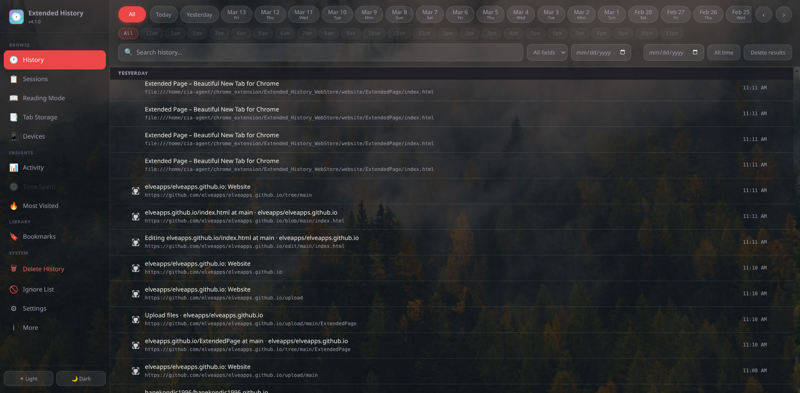

#  Extended History  

Chrome extension for extended history duration and better history view,  and option to store history for more then 90 days. 
Originaly made just because of 90 days limit in chromium,   instead of rebuilding chromium I made extension. I hope it works... 
**Features:**
<pre>
-Filter history by date, url, title
-See time spent on websites and total page loads
-Export and import history and bookmarks
-Export session tabs and see previous sessions
-Quick access to recent history by pressing extension button 
-Change accent colors and wallpapers with glass like UI if you are into that
-Delete history per day, based on filter, or selection
-Option to periodically save session as html file
-Keep history more then 90 days
-Store tabs
-Encrypt history exports
-Read exported history, without import, even encrypted ones
</pre>
**To do (ordered by importance):**
<pre>
-Fix browser cache based favicon resolver
-Fix translations (i need help with this, i can't translate dynamic parts)
-Maybe switch to using IndexedDB?
-Add better timestamp labels when browsing history
-Add whole history encryption and UI locking
 (abandoned, as locking UI requires deleting history at least at each browser startup, which removes auto suggest for address bar)
-Store page even if page didn't load completely
-Fix Tab Storage loading speed in popup
-Import history within certain time range
-Wallpaper switching at launch is slow, preload next wallpaper to be ready
-Reduce RAM usage when in bookmarks and overall
-Return option to show urls under link titles in popup
</pre>
 

