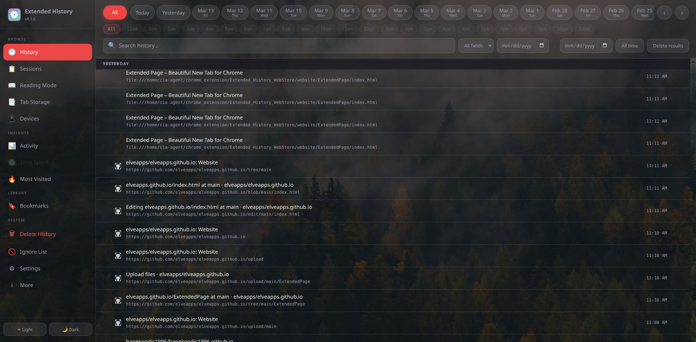

#  Extended History  

Chrome extension for extended history duration and better history view,  and option to store history for more then 90 days. 
Originaly made just because of 90 days limit in chromium,   instead of rebuilding chromium I made extension. I hope it works... 
**Features:**
<pre>
-Filter history by date, url, title
-See time spent on websites and total page loads
-Export and import history and bookmarks
-Export session tabs and see previous sessions
-Quick access to recent history by pressing extension button 
-Change accent colors and wallpapers with glass like UI if you are into that
-Delete history per day, based on filter, or selection
-Option to periodically save session as html file
-Keep history more then 90 days
-Store tabs
-Encrypt history exports
-Read exported history, without import, even encrypted ones
-Find history using quick filters
-Lock history
</pre>
**To do (ordered by importance):**
<pre>
-Popup/sidebar deleting in progress modal is missing
-Locking doesn't delete unencrypted data, just appends to localstorage (Important TO FIX)
-Fix browser cache based favicon resolver, by saving small favicons as base64 in localstorage
-Store page even if page didn't load completely
-Import history within certain time range
-Change favicon when site if site is in ignore list
</pre>
 

